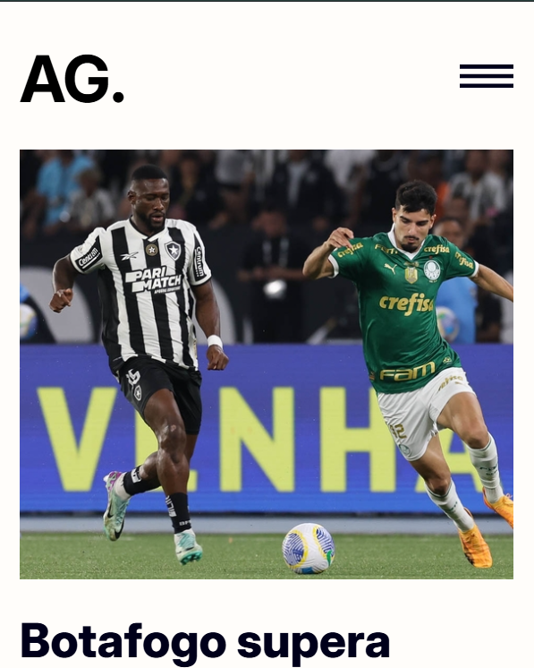

# AG. - Botafogo News Website 📰⚽

**AG.** is a simple and responsive news website built with **HTML**, **CSS**, and **JavaScript**, focused mainly on news about **Botafogo**, a traditional Brazilian football club.

## 📸 Preview

### Desktop


### Mobile


## 🧰 Technologies Used

- **HTML5** – Semantic and accessible structure.
- **CSS3** – Custom styles and responsive layout.
- **JavaScript** – For interactive elements and future dynamic features.

## 📋 Features

- Clean and modern layout
- Responsive design (mobile-first)
- News sections: Latest, Popular, Trending, Categories
- Sidebar with highlights and recent news

## 🚀 Getting Started

To run this project locally:

1. Clone this repository:
   ```bash
   git clone https://github.com/yourusername/ag-news-site.git
